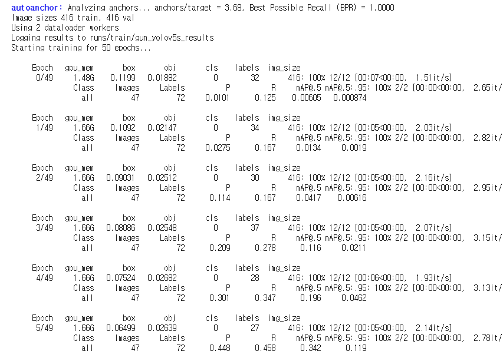
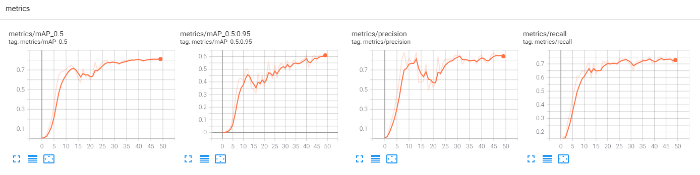
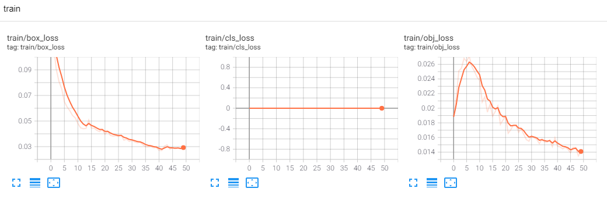
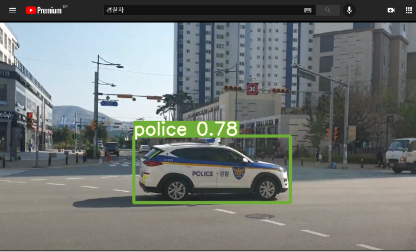
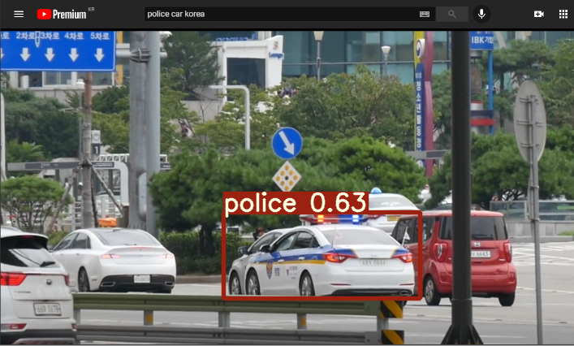
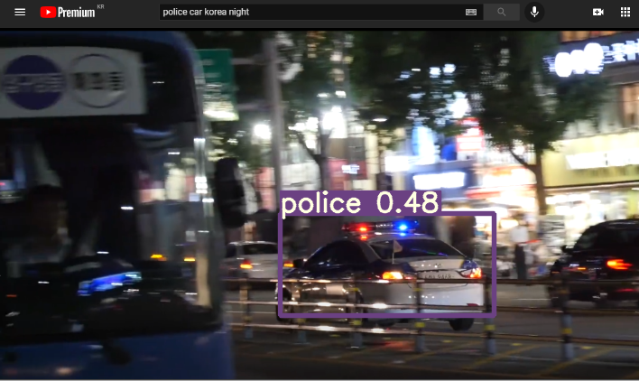

## Build Custom Learning Model with YOLOv5
## 나만의 커스텀 러닝 모델 만들기

---
## Overview
이번에 소개해드리는 코드는 딥러닝 모델을 학습하여 실제 사용하고자 하는 분들을 위해 만들었습니다.

원하시는 Object(차량, 사물, 사람 등등)를 검출하기 위해 진행된 절차를 소개해 드리면서 그 결과에 대한 내용을 첨부하였으니, 참고하셔서 순차적으로 진행하시면 되겠습니다.

또한 본 개발에서는 Car Object Detection을 Customization 하기 위해 국내 Police Car Detection을 구현하였습니다.

##1. Make Dataset using Google Images 
먼저 딥러닝 학습을 진행하기 위해서는 기본적으로 학습하고자 하는 Dataset가 필요하다. 보통 Image(.jpg, .png 등등) 파일과 각 Image에서 학습하고자 하는 Object의 좌표(이미지 내 좌표)를 담고 있는 Label(.txt)를 바탕으로 수행된다.

하지만 일반적으로 무수한 Dataset를 구축하기 위해서는 상당한 시간과 작업이 필요하다.

따라서 본 개발에서는 구글 이미지를 사용하여 Dataset를 만드는 방법을 소개합니다. 방법은 [쥬디다무](https://www.youtube.com/watch?v=m7jwlDhsfQ4) 의 Youtube 채널을 참고한다.

1. 크롬을 열고 구글 검색창에 원하는 이미지를 검색한다.
2. 이미지 쪽으로 넘어가서 스크롤을 원하는 만큼 내린다 (많으면 많을 수록 Dataset 증가)
3. Shift + Ctrl + i 버튼을 누른 뒤, 옆에 열리는 창 윗부분에서 Console을 클릭
4. git code의 pre_learning/js_console.js 파일을 메모장으로 열고 모든 내용을 선택하여 복사
5. 엔터를 치고 나면 urls.txt 파일이 다운되는데, 이를 pre_learning 폴더에 덮어 씌운다
6. pre_learning 폴더 상단 주소 창에 cmd를 입력한 뒤 아래와 같은 명령어를 입력하여 이미지를 다운 받는다. (train_data/images/train 는 예시 폴더이며, 원하는 경로에 폴더를 생성하여 입력하면 된다.) 
```bash
$> python download_images.py --urls urls.txt --output train_data/images/train
```
7. 마찬가지로, validation을 위한 image 4~10장 정도(?)를 추려 train_data/images/val 에 저장한다.

##2. Labeling and Remove Residual Images
1번과 같이 진행하여 무수히 많은 image를 확인할 수 있을 것이다. 하지만 모든 이미지가 다 원하는 이미지가 아닐 수 있기 떄문에, 원하는 이미지만을 Labeling 하고 그외 이미지는 버리는 과정을 진행한다.
이는 [DeepLearing](https://www.youtube.com/watch?v=GRtgLlwxpc4&t=734s) 의 Youtube 채널을 참고한다.

1. 편리한 Labeling을 위해 [Makesense.ai](https://www.makesense.ai/) 사이트에 들어간다.
2. 우측 하단의 Get Started를 누른 뒤, images를 담은 폴더를 드래그 하여 옮긴다. 이후 Object Detection을 클릭한다.
3. Create Labels의 "Your label list is empty"가 나오면 왼쪽 상단의 '+'를 눌러 Insert Label에 원하는 label를 입력한다. 본 개발에서는 Police를 입력하였다.
4. 이후 각 이미지가 나오는데, 원하는 영역을 드래그 한 뒤, 우측의 Select label에서 입력한 Label를 입력한다. 본 개발에서는 Police를 입력하였다. 또한, labeling을 원하지 않는 image는 무시하고 넘어간다. (상당한 작업 필요)
5. Labeling을 다 끝냈다면, 좌측 상단 Action -> Export Annotation에 들어가서 A.zip...YOLO format만 클릭하여 export 한 뒤, label file을 담은 .zip 파일을 다운받는다.
6. zip 파일을 unzip한 뒤, text file들을 train_data/labels/train 파일에 옮긴다.
7. validation image 또한 위와 같이 작업하여 train_data/labels/val 에 옮긴다.
8. 이후, labeling 하지 않은 이미지를 삭제하기 위해 remove_without_labeled.py를 실행한다.

##3. Training and Testing with YOLOv5
이제 Dataset이 구축이 되었다면, YOLOv5를 기반으로 학습을 진행한다. 학습 방법은 [빵형의 개발도상국](https://www.youtube.com/watch?v=T0DO1C8uYP8&t=820s) 의 Youtube 채널을 참고한다.

본 개발에서는 police car만을 딥러닝 하기 때문에, 다음과 같이 data.yaml을 수정한다.
```bash
train: ../images/train/  
val: ../images/val/  

nc: 1  
names: ['police'] 
```
여기서 nc는 Class 수를 의미하며, names는 각 Class type를 명칭한다.

.yaml를 수정한 뒤, 위의 Youtube를 참고하여 학습을 진행한다.

###[Learning Progress]


이후 학습이 잘 진행되었다면, 이 모델에 대한 성능을 확인할 수 있다. 본 개발에서는 precision과 recall이 0.8~0.9를 나타내며, Train, validation Loss 또한 0에 근접한 것을 확인할 수 있다.

###[Results of the Model Performance]




####학습이 다 완료되었다면, weight 폴더 내 best.pt를 다운로드받아 Main.py가 들어있는 폴더에 저장한다.

##4. Implementation
3번에서 학습한 모델을 기반으로 객체 검출을 활용하기 위해, 본 개발에서는 컴퓨터 화면에서의 영상을 실시간으로 파싱하여 검출하는 코드를 작성하였다. 

실행 방법은 Main.py를 실행한 뒤, youtube에 추출하고자 하는 객체에 대한 영상을 실행하여 좌측 상단에 영상을 놓는다.

이후 객체가 검출되어 score가 0.5 이상이 될 경우, System의 Beep 소리와 함께 청각과 시각적으로 확인할 수 있다.
###[Monitering from the Main.py]





## Reference
[1] [쥬디다무](https://www.youtube.com/watch?v=m7jwlDhsfQ4)

[2] [DeepLearing](https://www.youtube.com/watch?v=GRtgLlwxpc4&t=734s)

[3] [빵형의 개발도상국](https://www.youtube.com/watch?v=T0DO1C8uYP8&t=820s)
